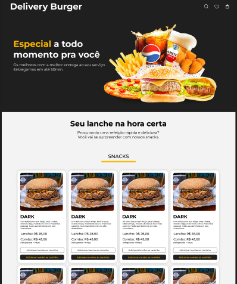

# BURGUER DELIVERY



<br/>
FIGMA:
https://www.figma.com/design/4b4NNab7O7kYsEbE5kn2Gx/Untitled?node-id=0-1&p=f&t=lbbIx2YQSRzEDWbd-0


## Para rodar o projeto
```js
npm i
```

```js
npm run dev
```

## Funcionalidades

### 1. **Consumo de Endpoints de Categorias de Produtos**
A aplicação consome diferentes endpoints para obter os produtos categorizados. Todos os itens são apresentados na mesma página.

### 2. **Adição ao Carrinho**
Ao clicar em um produto, ele é adicionado ao carrinho de compras. O total do carrinho é atualizado automaticamente conforme o produto é adicionado, considerando o valor e a modalidade do produto (por exemplo, diferentes opções de preço ou tamanhos).

#### Funcionalidade Detalhada:
- Cada item possui um botão "Adicionar ao Carrinho".
- Ao adicionar, o produto é armazenado no estado do carrinho.
- O total do carrinho é recalculado com base no valor do produto adicionado.
  
### 3. **Modalidade de Pagamento**
Quando o usuário decide finalizar a compra, ele é redirecionado para uma tela onde pode escolher a forma de pagamento.

#### Etapas:
- O total da compra é exibido.
- O usuário escolhe a forma de pagamento.

  
### 4. **Login para Primeira Compra**
Caso o usuário esteja realizando a compra pela primeira vez, ao clicar em "Finalizar Compra", a aplicação irá redirecioná-lo para um formulário de login.

#### Etapas:
- O usuário preenche suas informações de login.
- Após o login bem-sucedido, o usuário é redirecionado para a tela de pagamento.
  
### 5. **Finalização da Compra**
Se o usuário já tiver feito login ou já tiver uma conta, a aplicação faz a requisição POST para criar o pedido.

#### Requisição POST:
- A aplicação envia uma requisição para o servidor (endpoint "Order") contendo as informações do pedido, como os produtos no carrinho, o total, e os dados do usuário.
- O servidor processa a ordem e retorna uma confirmação de compra.


---

## Fluxo de Navegação

1. **Tela Inicial**: Exibe os produtos (Burger, Beverage, Appetizer, Dessert).
2. **Adicionar ao Carrinho**: O usuário escolhe um produto e o adiciona ao carrinho, que é atualizado com o novo total.
3. **Carrinho de Compras**: O usuário pode ver os produtos adicionados, o total da compra e decidir finalizar a compra.
4. **Tela de Login**: Caso seja a primeira compra do usuário, ele é direcionado para o login.
5. **Tela de Pagamento**: O usuário escolhe a forma de pagamento e finaliza a compra.
6. **Finalização do Pedido**: A aplicação envia os dados do pedido para o servidor.

---


